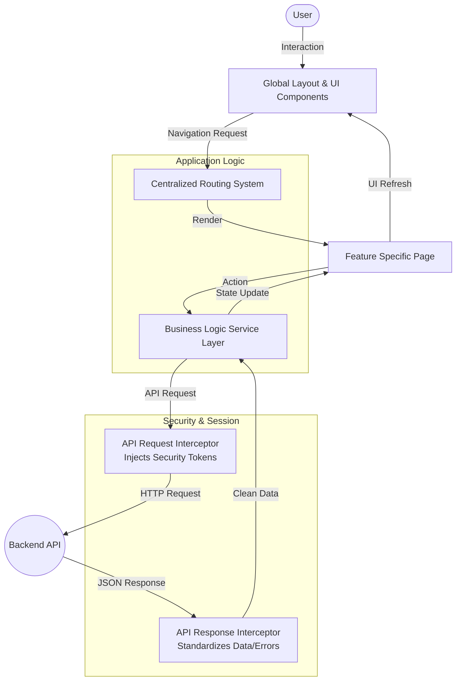

# Client Presentation: Application Technical Documentation

This document provides a high-level overview of the application's technical architecture, tech stack, and core implementation strategies. It is designed to provide stakeholders with a clear understanding of the robust and scalable foundations upon which the application is built.

## Architecture Flow Diagram

The following diagram illustrates the high-level flow of data and control within the application, showing how user interactions propagate through the various architectural layers.

## 1. Technology Stack

The application leverages a modern, high-performance tech stack designed for speed, reliability, and maintainability.

- **Frontend Core**: **React 19** – utilizing the latest features for optimized rendering and developer productivity.
- **Build Tooling**: **Vite** – ensuring lightning-fast development cycles and optimized production builds.
- **Styling**: **Tailwind CSS** – providing a highly customizable and efficient utility-first design system.
- **API Communication**: **Axios** – a robust client for handling asynchronous data fetching and service interactions.
- **Routing**: **React Router (v7)** – managing complex navigational flows with declarative route definitions.

## 2. UI Architecture

The user interface is built on a modular and component-driven architecture, ensuring a consistent user experience and ease of updates.

- **Global Layout System**: A centralized layout engine manages the common interface elements, providing a structural framework for all internal views.
- **Modular View Components**: Feature-specific pages are isolated as independent modules, allowing for parallel development and focused testing.
- **Shared UI Library**: A collection of reusable elements ensures visual consistency across the entire platform.
- **Responsive Design**: The architecture is built from the ground up to be responsive, providing a seamless experience across desktop and mobile devices.

## 3. Business Logic & Service Layer

Business logic is decoupled from the UI components through a dedicated **Service-Oriented Architecture (SOA)**.

- **Encapsulated Logic**: All data processing, validation, and domain-specific rules are contained within dedicated service modules.
- **Authentication Services**: Secure management of user identity, session handling, and multi-factor authentication (MFA) flows.
- **User Management Services**: Centralized handling of user profiles, settings, and authorization levels.
- **Data Persistence**: Services manage the interaction with browser storage for session state and preference persistence.

## 4. Routing & Navigation Strategy

The application employs a centralized navigation registry to manage application state and URL synchronization.

- **Declarative Route Configuration**: All application paths are defined in a single, predictable registry.
- **Nested Routing**: Supports complex view hierarchies, allowing for persistent interface elements (like navigation rails) while switching sub-views.
- **Protected Access**: Integration with the service layer ensures that sensitive routes are only accessible to authorized users.

## 5. API Client & Global Interceptors

A specialized API communication layer handles all interactions with the backend services.

- **Unified API Client**: A standardized instance for all network requests ensures consistent configuration (base URLs, timeouts, headers).
- **Request Interception**: Automatically injects security tokens (e.g., Bearer tokens) into outgoing requests without manual intervention.
- **Response Handling**: Centrally processes incoming data and standardizes error formats for the application.
- **Global Error Management**: Implements proactive error handling for common scenarios:
  - **401 Unauthorized**: Automatic session cleanup and redirect to re-authentication.
  - **Network Failures**: Real-time user notification for connectivity issues.
  - **HTTP Errors**: Standardized display of server-side messages.

## 6. Configuration & Environment Management

The application behavior is controlled through a flexible environment-driven configuration system.

- **Environment Isolation**: Separate configurations for development, staging, and production environments.
- **Secure Configuration**: Sensitive endpoints and API keys are managed through secure environment variables.
- **Dynamic Constants**: Key application parameters (timeouts, limits, feature flags) are centralized for easy management.

## 7. Feature Showcase

The application delivers a comprehensive suite of features designed to provide an exceptional user experience for healthcare management and career counseling services.

### Core User Features

#### **Doctor Availability & Appointment Booking**

A sophisticated doctor discovery and booking system that streamlines the appointment scheduling process:

- **Advanced Filtering**: Users can filter doctors by specialization (Cardiologist, Neurologist, Pediatrician, Orthopedic, Dermatologist) and select preferred appointment dates
- **Comprehensive Doctor Profiles**: Each doctor card displays essential information including:
  - Professional credentials and specialization
  - Star ratings and years of experience
  - Languages spoken for multilingual support
  - Transparent consultation fee display
  - Real-time availability with multiple time slot options
- **Interactive Booking Flow**:
  - One-click time slot selection
  - Confirmation modal with complete appointment summary
  - Formatted date display for clarity
  - Instant booking confirmation
- **Responsive Design**: Optimized layouts for desktop, tablet, and mobile devices ensuring accessibility across all platforms

#### **Appointment Management**

Centralized dashboard for managing scheduled appointments:

- View upcoming appointments with counselors and interviewers
- Quick access to meeting details (date, time, professional)
- Reschedule functionality for flexibility
- Direct meeting entry for virtual sessions

#### **Session History**

Complete historical record of past counseling and interview sessions:

- Chronological session tracking
- Session details and outcomes
- Progress monitoring over time

#### **Account Settings**

Comprehensive profile management system:

- Personal information management (name, date of birth, marital status, gender)
- Professional details (occupation, education, university)
- Complete address management
- Contact information (phone, email)
- Secure password change functionality
- Profile picture upload

#### **Blog Submission**

Content creation platform for sharing experiences and insights:

- Rich text composition interface
- Image upload support (JPEG format)
- Community engagement through shared stories

### Navigation & User Experience

- **Unified Sidebar Navigation**: Consistent navigation across all pages with active state indicators
- **Intuitive Layout**: Clean, professional interface following modern design principles
- **Visual Feedback**: Hover effects, animations, and micro-interactions enhance usability
- **Glassmorphism & Gradients**: Modern aesthetic with depth and visual appeal
- **Accessibility**: Keyboard navigation support and semantic HTML structure

---

This architecture ensures that the application is not only functional but also maintainable, secure, and ready for future scaling.

The project currently uses a single hardcoded Jitsi URL per appointment, and it is not unique by doctor vs patient.

In [Appointments.jsx](/home/vo-15/new/tesr/test/Orion_React_App/src/pages/Appointments.jsx#L12), each appointment object has one `url` field, for example:
- `https://meet.jit.si/OrionCareerCounselingSession`
- `https://meet.jit.si/OrionPracticeJobInterview`

When the user clicks Enter Meeting, that exact same `appointment.url` is loaded into the iframe in [Appointments.jsx](/home/vo-15/new/tesr/test/Orion_React_App/src/pages/Appointments.jsx#L30) and [Appointments.jsx](/home/vo-15/new/tesr/test/Orion_React_App/src/pages/Appointments.jsx#L137).

What that means:
- The link is unique per appointment entry only.
- There is no separate doctor link and patient link.
- Anyone opening the same Jitsi URL joins the same meeting room.

Also, I did not find any backend/API logic generating dynamic meeting links. The booking screens in [DoctorAvailability.jsx](/home/vo-15/new/tesr/test/Orion_React_App/src/pages/DoctorAvailability.jsx) and [PatientAppointment.jsx](/home/vo-15/new/tesr/test/Orion_React_App/src/pages/PatientAppointment.jsx) only show mock booking UI and alerts; they do not create meeting URLs.

If you want, I can next trace how to make meeting links truly unique per booked appointment and optionally role-aware for doctor/patient.

is there any os releated dewpendancy  of the Jitsi
